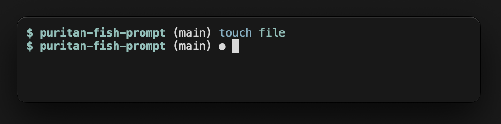

# puritan-fish-prompt

A minimal prompt for the [Fish Shell](https://fishshell.com). Inspired by Robby Russel. 

## Features

- Displays the current directory
- Support for `git` *(branch name and repository status)*. Displays a circle if the branch is dirty.
- Displays '$' for user session and '#' for root session

## Screenshot



## Installation


### Requirements

You need [Fish Shell](https://fishshell.com) and [Oh My Fish!](https://github.com/oh-my-fish/oh-my-fish/).

### Installing

#### create new theme

`$ omf new theme puritan`

#### open config file

`$ vim ~/.config/omf/themes/puritan/fish_prompt.fish`

```fish
function _git_branch_name
    echo (command git symbolic-ref HEAD 2> /dev/null | sed -e 's|^refs/heads/||')
end

function _is_git_dirty
    echo (command git status -s --ignore-submodules=dirty 2> /dev/null)
end

function fish_prompt
    set -l last_status $status
    set -l cyan (set_color -o cyan)
    set -l magenta (set color -o magenta)
    set -l normal (set_color normal)

    set -l cwd $cyan(basename (prompt_pwd))

    if [ (_git_branch_name) ]
        set -l git_branch (_git_branch_name)
        set git_info "$normal ($magenta$git_branch$normal)"
        if [ (_is_git_dirty) ]
            set -l dirty "$normal ●"
            set git_info "$git_info$dirty"
        end
    end

    # terminate with a nice prompt char:
    if [ (id -u) = 0 ]
        set indicator '#'
    else
        set indicator '$'
    end

    echo -n -s $cyan $indicator $normal ' ' $cwd $git_info $normal ' '
end
```

#### switch to new theme
`$ echo "puritan" > ~/.config/omf/theme`
